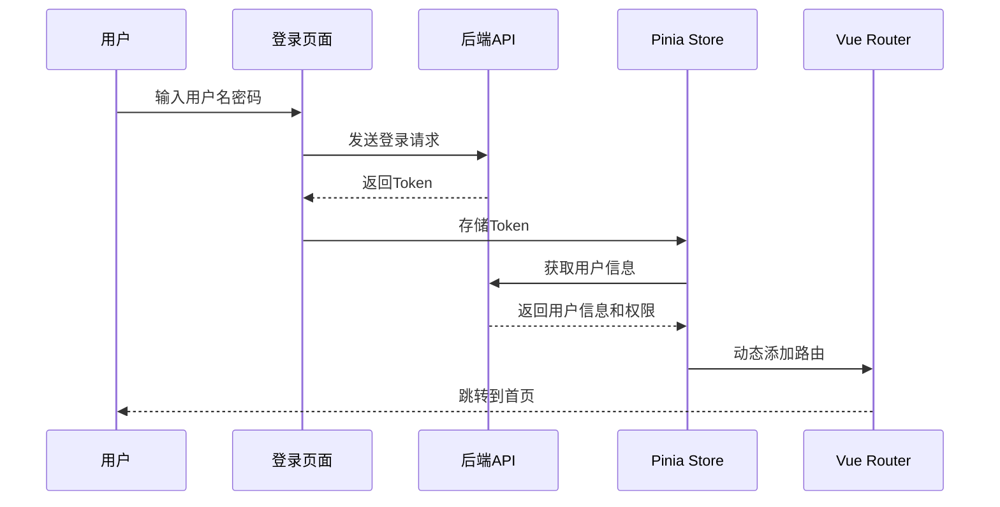
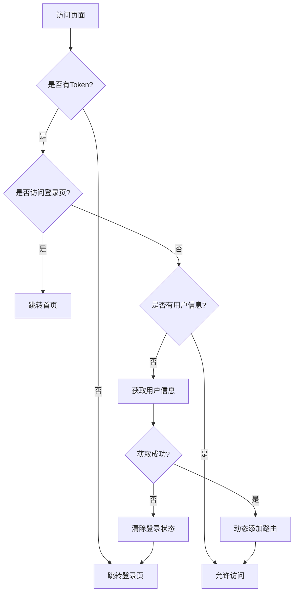
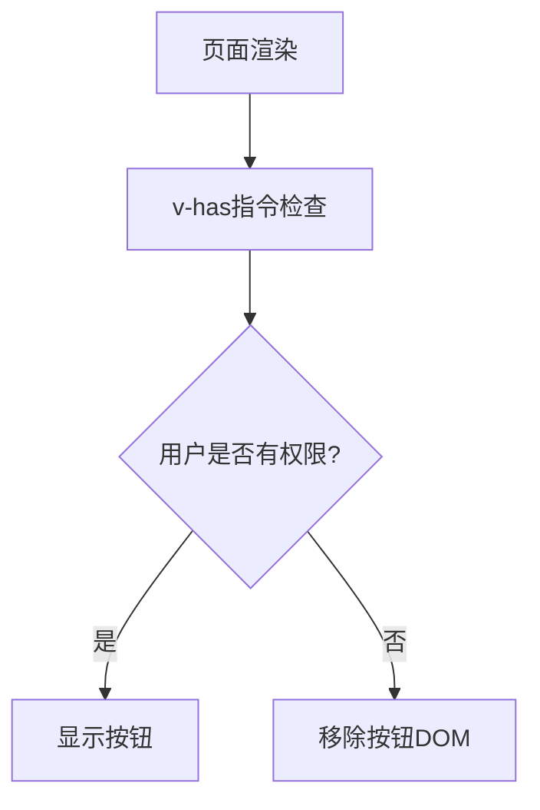

# Vue Admin Main 项目权限管理功能分析

## 项目概述

Vue Admin Main 是一个基于 Vue 3 + TypeScript + Element Plus 的后台管理系统，已实现了完整的权限管理功能体系。

## 权限管理架构

### 1. 权限管理核心文件结构

```
src/
├── permission.ts                    # 路由权限守卫
├── directive/
│   └── has.ts                      # 按钮级权限指令
├── store/modules/
│   └── user.ts                     # 用户权限状态管理
├── router/
│   └── routes.ts                   # 路由权限配置
├── api/
│   ├── user/                       # 用户认证API
│   └── acl/                        # 权限管理API
│       ├── user/                   # 用户管理
│       ├── role/                   # 角色管理
│       └── menu/                   # 菜单管理
└── views/acl/                      # 权限管理页面
    ├── user/                       # 用户管理页面
    ├── role/                       # 角色管理页面
    └── permission/                 # 菜单权限管理页面
```

## 权限功能实现详情

### 1. 路由权限管理 (`src/permission.ts`)

#### 功能特点：

- 全局路由前置守卫，控制页面访问权限
- Token 验证和用户信息校验
- 自动处理登录状态和重定向

#### 核心逻辑：

```typescript
router.beforeEach(async (to, from, next) => {
  let token = userStore.token
  let username = userStore.username

  if (token) {
    // 已登录用户逻辑
    if (to.path === '/login') {
      next({ path: '/' }) // 跳转到首页
    } else {
      if (username) {
        next() // 有用户信息，直接通过
      } else {
        // 获取用户信息
        try {
          await userStore.userInfo()
          next({ ...to })
        } catch (error) {
          // 获取失败，清除登录状态
          await userStore.userLogout()
          next({ path: '/login', query: { redirect: to.path } })
        }
      }
    }
  } else {
    // 未登录用户，只能访问登录页
    if (to.path == '/login') {
      next()
    } else {
      next({ path: '/login', query: { redirect: to.path } })
    }
  }
})
```

### 2. 按钮级权限控制 (`src/directive/has.ts`)

#### 功能特点：

- 自定义指令 `v-has` 控制按钮显示/隐藏
- 基于用户 buttons 数组进行权限判断
- DOM 级别的权限控制

#### 实现代码：

```typescript
export const isHasButton = (app: any) => {
  app.directive('has', {
    mounted(el: any, options: any) {
      // 检查用户按钮权限数组
      if (!userStore.buttons.includes(options.value)) {
        el.parentNode.removeChild(el) // 移除按钮DOM
      }
    },
  })
}
```

#### 使用示例：

```vue
<el-button v-has="`System:User:Add`" @click="addUser">添加用户</el-button>
```

### 3. 动态路由管理 (`src/store/modules/user.ts`)

#### 功能特点：

- 基于用户权限动态添加路由
- 支持路由的动态添加和移除
- 菜单权限与路由权限联动

#### 关键实现：

```typescript
async userInfo() {
  let res: userInfoResponseData = await reqUserInfo()
  if (res.code === 200) {
    this.username = res.data.name
    this.avatar = res.data.avatar

    // 获取全部路由（当前实现）
    let userAsyncRoute = cloneDeep(asyncRoute)
    this.menuRoutes = [...constantRoute, ...userAsyncRoute, anyRoute]
    dynamicRoutes = [...userAsyncRoute, anyRoute]

    // 动态添加路由
    dynamicRoutes.forEach((route) => {
      router.addRoute(route)
    })

    return 'ok'
  }
}
```

#### 路由配置结构：

```typescript
// 公共路由 - 所有用户可访问
export const constantRoute = [
  { path: '/login', component: Login },
  { path: '/', component: Layout, children: [Home] },
  { path: '/screen', component: Screen },
  { path: '/404', component: NotFound },
]

// 动态路由 - 需要权限验证
export const asyncRoute = [
  {
    path: '/acl',
    component: Layout,
    name: 'Acl',
    meta: { title: '权限管理', icon: 'Lock' },
    children: [
      { path: '/acl/user', component: UserManage, name: 'User' },
      { path: '/acl/role', component: RoleManage, name: 'Role' },
      { path: '/acl/permission', component: MenuManage, name: 'Permission' },
    ],
  },
  // 商品管理模块...
]
```

### 4. 权限管理页面

#### 4.1 用户管理 (`src/views/acl/user/index.vue`)

- **功能**：用户的增删改查
- **权限分配**：为用户分配角色
- **数据验证**：用户名、昵称、密码格式验证

#### 4.2 角色管理 (`src/views/acl/role/index.vue`)

- **功能**：角色的增删改查
- **权限分配**：为角色分配菜单权限
- **树形控件**：使用 Element Plus Tree 组件展示权限层级

#### 4.3 菜单管理 (`src/views/acl/permission/index.vue`)

- **功能**：菜单/权限的增删改查
- **层级管理**：支持 4 级菜单结构（一级菜单 → 二级菜单 → 三级菜单 → 按钮权限）
- **权限值配置**：为每个菜单项配置对应的权限标识

### 5. API 接口设计

#### 5.1 用户认证接口 (`src/api/user/index.ts`)

```typescript
enum API {
  LOGIN_URL = '/admin/acl/index/login', // 登录
  USERINFO_URL = '/admin/acl/index/info', // 获取用户信息
  LOGOUT_URL = '/admin/acl/index/logout', // 登出
  CAPTCHA_URL = '/admin/acl/index/captcha', // 验证码
}
```

#### 5.2 用户管理接口 (`src/api/acl/user/index.ts`)

```typescript
enum API {
  ALLUSER_URL = '/admin/acl/user', // 用户列表
  ADDUSER_URL = '/admin/acl/user/save', // 添加用户
  UPDATEUSER_URL = '/admin/acl/user/update', // 更新用户
  ALLROLEURL = '/admin/acl/role/toAssign', // 获取用户角色
  SETROLE_url = '/admin/acl/role/doAssign', // 分配角色
  DELETEUSER_URL = '/admin/acl/user/remove', // 删除用户
}
```

#### 5.3 角色管理接口 (`src/api/acl/role/index.ts`)

```typescript
enum API {
  ALLROLE_URL = '/admin/acl/role/', // 角色列表
  ADDROLE_URL = '/admin/acl/role/save', // 添加角色
  UPDATEROLE_URL = '/admin/acl/role/update', // 更新角色
  ALLPERMISSION_URL = '/admin/acl/permission/toAssign/', // 获取角色权限
  SETPERMISSION_URL = '/admin/acl/permission/doAssign', // 分配权限
  REMOVEROLE_URL = '/admin/acl/role/remove/', // 删除角色
}
```

### 6. 数据类型定义

#### 6.1 用户信息类型

```typescript
export interface userInfoResponseData extends ResponseData {
  data: {
    routes: string[] // 路由权限
    buttons: string[] // 按钮权限
    roles: string[] // 用户角色
    name: string // 用户名
    avatar: string // 头像
  }
}
```

#### 6.2 权限状态管理

```typescript
interface UserState {
  token: string // 认证令牌
  menuRoutes: RouteRecordRaw[] // 菜单路由
  username: string // 用户名
  avatar: string // 用户头像
  buttons: string[] // 按钮权限数组
}
```

## 权限控制流程

### 1. 登录认证流程



### 2. 路由权限验证流程



### 3. 按钮权限控制流程



## 当前实现状态

### ✅ 已实现功能

1. **路由权限控制** - 完整的路由守卫机制
2. **按钮级权限控制** - v-has 自定义指令
3. **用户管理** - 用户的增删改查和角色分配
4. **角色管理** - 角色的增删改查和权限分配
5. **菜单管理** - 菜单权限的层级管理
6. **动态路由** - 基于权限的路由动态加载
7. **状态管理** - 完整的权限状态管理

### ⚠️ 注意事项

1. **路由过滤功能被注释** - 第 66-73 行的动态路由过滤代码被注释，当前所有用户可看到全部菜单
2. **按钮权限数组为空** - `buttons` 数组当前为空，需要后端返回具体的按钮权限数据
3. **权限验证依赖后端** - 真实的权限验证需要后端接口支持

📁 文件：vue-admin-main/src/store/modules/user.ts

📍 行号：第 66-73 行

🔧 方法：userInfo() 方法内部

被注释的具体代码：

```
        // 屏蔽动态路由 不进行过滤
        // let userAsyncRoute = filterAsyncRoute(
        //   cloneDeep(asyncRoute),
        //   res.data.routes,
        // )
        // this.menuRoutes = [...constantRoute, ...userAsyncRoute, anyRoute]
        // dynamicRoutes = [...userAsyncRoute, anyRoute] // 记录动态添加的路由
        // dynamicRoutes.forEach((route) => {
        //   router.addRoute(route) // 动态添加路由
        // })
```

确保后端返回 res.data.routes 数组

### 🔧 可优化项

1. **启用路由过滤** - 根据用户权限过滤显示的菜单
2. **完善按钮权限** - 实现细粒度的按钮权限控制
3. **权限缓存** - 添加权限信息的本地缓存机制
4. **权限刷新** - 实现权限变更后的实时更新

## 技术栈

- **前端框架**：Vue 3 + TypeScript
- **UI 组件库**：Element Plus
- **状态管理**：Pinia
- **路由管理**：Vue Router 4
- **HTTP 客户端**：Axios
- **构建工具**：Vite

## 总结

Vue Admin Main 项目已经实现了一套相对完整的权限管理系统，包含了用户认证、路由权限、按钮权限、角色管理等核心功能。项目采用了现代化的技术栈，代码结构清晰，具有良好的可维护性和扩展性。主要的权限控制机制都已到位，只需要根据实际业务需求调整具体的权限配置即可投入使用。
